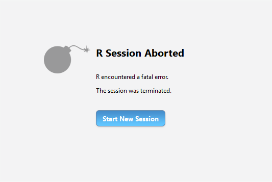

## Learning Objectives

Welcome to <R SQL Fundamentals>. Our goals for today's workshop are:

1.  Explain what a relational database is and why we would want to use it.

2.  Access and query a database using SQL.

3.  Use `DBI` and `dbplyr` to query data from a relational database.

Throughout this workshop series, we will use the following icons:

🔔 **Question**: A quick question to help you understand what's going on.

🥊 **Challenge**: Interactive exercise. We'll go through these in the workshop!

⚠️ **Warning**: Heads-up about tricky stuff or common mistakes.

💡 **Tip**: How to do something a bit more efficiently or effectively.

📝 **Poll**: A zoom poll to help you learn.

🎬 **Demo**: Showing off something more advanced so you know what you can use R for in the future

## Motivation

In many situations, you will work with data that is too big to fit into your R memory (or local environment).

However, R reads data into random-access memory (RAM) at once and this object lives in memory entirely.

-   If object.size \> memory.size, the process will crash R.

-   Therefore, we would want to **reduce the size of the data** when we read it in R for any type of big data analysis.



### Techniques to deal with big data

For medium sized files (1-2 GB), you may try to reduce the size of the file by using R packages and functions . For example:

-   `data.table::fread(file path, select = c("column 1", "column 2"))`. This command imports data faster than `read.csv()` does. You can also import only the columns you're interested in.

    -   However, with `data.table::fread`, you can't filter the data to specific conditions before reading the data.

For even larger files (\> 2-10 GB), a standard practice is to locate the data into a **database** and **access** it. In other words, you would want to explore the data and pull the objects of interest when you need them.

### What is a Relational Database?

A **relational database** is a collection of tables (fixed columns and rows). It is a type of database that stores data in **tables** that are related to each other.

-   Each table consists of rows (records) and columns (attributes or fields), where each column represents a specific attribute of the data, and each row corresponds to a unique data record.

You can think of excel spreadsheets, where each spreadsheet has rows and columns. However, a key difference is that these tables can be connected to each other based on shared information.

{.uri}](../images/excel_spreadsheets.png)

The defining feature of a relational database is that it uses a relational model, meaning that the relationships between data elements are established through keys. This allows for easy data querying, management, and maintenance.

-   **Data querying** is the process of retrieving data from a database by filtering, sorting, or aggregating the information based on specific conditions.

In the example below, we have a relational database where three tables are connected to each other through keys (Name, Tag \#).


🔔 **Question**: Imagine you are managing a small online bookstore. You want to track the following information to analyze customer preference for targeted promotions: books (Each book has a title, author(s), publication year, genre, and price) and customers (Each customer has a name and an email). How would you create a relational database to track which books each customer bought? What could be a key?

## What is SQL?

SQL (Structured Query Language), read SEQUEL, is a standardized programming language used to interact with relational database management systems. SQL is the most common language employed in data querying, with its purpose being to extract, manipulate, and analyze data stored in relational databases. Here are some facts about SQL:

-   SQL was developed by IBM Corporation in the 1970s.

-   SQL allows users to create, read, update, and delete data stored in relational database tables, as well as manage the database itself.

-   SQL is a **declarative** **language**, not a procedural language. This allows a much easier, optimized data querying ([what to do \> how to do](https://www.sqlite.org/queryplanner.html)).

    -   A declarative language focuses on *what* you want to achieve, rather than *how* to do it. The database management system will figure out an optimal way to execute the query.

    -   A procedural language, in contrast, requires you to specify *how* the task is accomplished, step by step.

        -   Step 1: Open a connection to the database.

        -   Step 2: Scan the employees table row by row.

        -   Step 3: Check if the department column equals 'HR'.

        -   Step 4: Extract the name and age values for matching rows.

        -   Step 5: Return the results.

### SQL Workflow

Here is what a typical SQL workflow would look like:

-   Step 1: Create and connect to a database. Note that server also can be your laptop (called [localhost](https://en.wikipedia.org/wiki/Localhost#:~:text=In%20computer%20networking%2C%20localhost%20is,via%20the%20loopback%20network%20interface.)).


-   Step 2: Copy a table to the database

    -   Option 1: You can create a table and insert rows manually. In order to do that, you also need to define data schema (the structure of the database).

    -   Option 2: Copy a file (object) to a table in a database using `copy_to`). We take this option as it's fast and we would like to focus on querying in this workshop.

-   Step 3: Query the table

-   Step 4: Pull the results of interests (more simply put, your queried data)

-   Step 5: Disconnect the database

## Setup

### Load Packages

We are going to rely on three key packages in R to interact with SQL in R. The standard practice is to use these packages in tandem for greater flexibility.

-   `DBI` is a **general-purpose SQL Interace**, meaning you can use it to interact with different database engines. It allows users to directly execute raw SQL commands for querying, creating, updating, and deleting data or tables.

-   `RSQLite` is an interface to the **SQLite** **database**. Like DBI, it enables you to create, read, update, and query databases using SQL commands. However, it is specific to the SQLite database.

    -   SQLite is a **relational database management system (RDBMS)** that uses SQL as its query language. It differs from other traditional RDBMS (e.g. MySQL, PostgreSQL) in that they are:

        -   Serverless: No need for a server process to manage the database.

        -   File-Based: Data is stored in a single `.sqlite` or `.db` file.

        -   Cross-Platform: SQLite databases can be used across different operating systems without modification.

-   `dbplyr` is a R-centric interface for interacting with databases using familiar `dplyr` syntax (e.g. mutate, filter, select). It abstracts SQL queries; you work with the database as if it's an in-memory `data.frame`.

    -   [dbplyr is a dplyr **backend**, which means that you keep writing dplyr code but the backend executes it differently.](https://r4ds.hadley.nz/databases#dbplyr-basics) … dbplyr translates to SQL.
    -   `dplyr` automatically loads `dbplyr` for you when it sees you working with a database.

We can load these package using `pacman::p_load()`, which reduces steps for installing and loading several packages simultaneously.

```{r}
# Load `pacman` package or install it if uninstalled
if (!require("pacman")) {
    install.packages("pacman")
}

# Load remaining packages
pacman::p_load(
 tidyverse, # Includes `dplyr` and `dbplyr` packages
 data.table,
 DBI,
 RSQLite
)
```

## Create a Database

For the most part, you will be using SQL to access a database that already exists for you. In this workshop, however, we're going to start with creating a new empty database in our memory.

We will first define a **backend engine** that we'll use to interact with the database. `RSQLite::SQLite()` is the function from the `RSQLite` package that specifies that the SQLite database engine is being used. This engine is what actually processes the database operations like creating tables, inserting data, querying, etc.

```{r}
# Define a backend engine 
drv <- RSQLite::SQLite()
```

Next, we will create an empty in-memory database.

`DBI::dbConnect` is the function from the **DBI** package used to establish a connection to a database. You are passing it two arguments:

-   `drv`: the backend engine (`RSQLite` in this case).

-   `dbname = ":memory:"`: this specifies that the database should be created **in-memory**, meaning the database exists only temporarily while the R session is active. No physical database file is created on the disk. Once the R session is closed, the data and database are lost.

```{r}
# Create an empty in-memory database 
con <- DBI::dbConnect(drv = drv, 
                      dbname = ":memory:")
```

When you create a database that is **not in-memory**, the data is saved to a file on your computer's disk storage.

-   This file can be accessed and used across different sessions, and the data will persist even if the program (or R session) is closed.

-   The database will exist as a physical file (e.g., an `.sqlite` file for SQLite) that can be shared, backed up, and transferred.

```{r}
# Create a database on the disk, instead of temporary memory (RAM)
# Remove the hashtag to create a database on your computer's disk
# con <- DBI::dbConnect(drv = drv,
                      # drv = dbname = "my_database.sqlite")
```

In most scenarios, you will be connecting to an existing database. In these situations, you likely need to specify the `host`, `user` , and `password` arguments. Think of these as the website, User ID, and password when you're accessing databases like Google Drive or Box.

```{r}
# Connect to an existing database 
# con <- DBI::dbConnect(RMariaDB::MariaDB(), 
  # host = "database.rstudio.com",
 # user = "hadley",
 # password = rstudioapi::askForPassword("Database password")
# )
```

## Copy Tables Into Database

Now that we successfully created and connected to a database, let's copy some existing tables into this database!

In this workshop, we will use data from the American Community Survey (ACS), an annual survey conducted by the Census. The ACS samples every 1 in 100 households and asks questions on people's jobs, income, food security, relationships etc. You can explore the data at IPUMS USA: <https://usa.ipums.org/usa/>. Social scientists typically refer to data about individual people as "micro" data.

We have `acs` table, which includes a sample of people from the 2022 ACS with variables on their job type, income, age and education.

We also have a separate `states` table, which contains state-level information on regional classification, total population, median income, median rent, poverty rate, and share of immigrant populations.

```{r}
# Read in data
acs <- data.table::fread("../data/ACS_age_income.csv.gz")
states <- read.csv("../data/ACS_state.csv")
```

These datasets are useful for familiarizing ourselves with SQL, because they can be connect to each other based on a key.

First, let's examine the datasets.

```{r}
head(acs)
head(states)
```

**🔔 Question:** What do you notice about these data tables? What column do you think might be used as keys?

We can use `DBI::dbWriteTable` function to write the data frames directly into a database table. It has the following arguments:

-   `conn` : The database connection object (created using `DBI::dbConnect`)

-   `name`: The name of the target table in the database

-   `value`: The R data frame to write to the database

-   `overwrite`: Overwrite if specified as `TRUE` .

```{r}
DBI::dbWriteTable(conn = con,
             name = "acs",
             value = acs)
```

Congratulations, you're now connected to a SQL database containing a data table!

### Databasing

Let's check if the tables were properly created in the connection, using `DBI:dbListTables` .

```{r}
dbListTables(con)
```

Once you have a table in the connection, you can use `DBI::dbListFields` to check the columns of each table.

```{r}
dbListFields(conn = con, "acs")
```

## 🥊 Challenge 1: Copying Data Tables to the Database

We've just written our first table into our database connection. Can you continue copying the `states` table to your database connection `con` and check what columns there are for those tables?

```{r}
# YOUR CODE HERE
dbWriteTable(conn = 
             name =  # Assign the same name when copying the table.
             value = )
```

Now, make sure that all your data tables were correctly written to the database connection.

```{r}
# YOUR CODE HERE

```

Can you check what columns there are for the `states` table in your connection?

```{r}
# YOUR CODE HERE

```

## SQL Querying

Once we have a connection with the different tables and we know what columns there are in each table, we can use this information to query our data. In this exercise, we will pull the first 10 rows of all columns in the `acs` data table.

There are multiple ways to query data within a SQL framework in R. However, we are going to be focusing on two approaches.

-   The first approach uses the `DBI` package and uses SQL commands to retrieve the data. This approach requires understanding of different SQL queries.

-   The second approach uses the `dbplyr` package and **does not rely on explicit SQL commands**. This approach is much easier for those who are already familiar with the `dplyr` syntax widely used in R data wrangling.

R users should try to familiarize themselves with both approaches.

Although SQL queries could be intimidating at first, they are very useful in a range of data science applications and allows more collaboration among researchers using different programming languages!

### Approach 1: `DBI::dbGetQuery`

The first approach uses the `dbGetQuery` function from the `DBI` package to query the tables from the connection. A standard SQL query involves the following commands:

-   **SELECT** desired columns

-   **FROM** tables

-   **WHERE** conditions are met

-   **ORDER BY** results in a specific order

There are multiple ways of querying data using SQL commands. Look into these additional resources if you want to explore further SQL queries ([SQL Tutorial](https://www.sqltutorial.org/sql-cheat-sheet/), [DataCamp](https://www.datacamp.com/cheat-sheet/sql-basics-cheat-sheet)).

Before we follow all these steps, let's first select all columns from `acs` table and the first ten rows to decide what data we would want to retrieve. We do this by specifying a `statement` argument in the `dbi::dbGetQuery` function.

In our statement, we have four components:

-   `SELECT *` : Select all columns (\*)

-   `FROM acs` : From the `acs` table in the connection.

-   `LIMIT 10` : Return the first 10 rows from the table.

-   `;` : The semicolon is used to **terminate** a query, telling the SQL engine that the query has ended and can be executed. It is optional for `dbGetQuery` function, but always including it is a good practice.

```{r}
dbGetQuery(conn = con,
    statement = "SELECT * 
                FROM acs
                LIMIT 10;")
```

Note that we can save our R memory if we run this function without saving the results as an object. This is really helpful when we are investigating a structure of a huge, complex big datasets.

#### Querying

Now that we are able to get a sense of what the overall table looks like, we can also use the `WHERE` and `ORDER BY` commands to fetch only the columns and values that we want for our analysis.

For example, what if we want to analyze the income of individuals between the ages of 25 and 34 living in California?

We would only need to retrieve individuals whose (1) `age` is between 25 and 34 and `state` is "California". We would also only need one additional column (`income`).

We can rewrite our query statement as follows:

-   `SELECT age, state, income` : Select specified columns

-   `FROM acs` : From the `acs` table in the connection.

-   `WHERE age >= 25 AND age <= 34 AND state = 'California'` : Filter to rows that meet all the specified conditions.

-   `ORDER BY age ASC, income DESC` : Sort the values in the ascending order of the `age` column and the descending order of the `income` column.

```{r}
acs_chunk <- dbGetQuery(conn = con, 
                statement = "SELECT age, state, income
                             FROM acs
                             WHERE age >= 25 AND age <= 34 AND state = 'California'
                             ORDER BY age ASC, income DESC;")

print(acs_chunk) # Check data frame
```

This exercise shows why SQL is such a powerful for managing and analyzing big data. Let's check how large our original `flights` dataset is compared to the new table we've just pulled using SQL query.

We can use `dim` function to check the dimensions (numbers of rows and columns) for each data frame.

```{r}
dim(acs) 
dim(acs_chunk) 
```

Notice that the original `acs` table has 72,551 rows and 13 columns, but `acs_chunk` only has 1,533 rows and 3 columns. That's roughly more than a 99% reduction in our data size!

If we have a specific question we want to answer with our dataset, we can use SQL queries to minimize the amount of data we are pulling into our R environment.

#### Joining Tables

A key feature of relational databases are that they can have multiple tables that can be joined with each other using keys. Joining allows researchers to merge different datasets to enrich their analysis.

We are not going to extensively cover the different types of join operations in this workshop, but below is a diagram for a quick reminder on the different types of joins ([link](https://tavareshugo.github.io/r-intro-tidyverse-gapminder/08-joins/index.html)).


For example, let's say we are interested in understanding how immigration is related to income levels at the state level. In addition to the `acs` table, we will now need to use the information on immigration share in the `states` table.

One approach to achieving this task is by conducting `dbGetQuery` twice—once for the `acs` table and the other for `states` table—and then joining the resulting data frames together in R.

```{r}
# Query and retrieve income data
acs_income <- dbGetQuery(conn = con, 
                statement = "SELECT age, income, state
                             FROM acs")

# Query and retrieve state-level immigration data
states_rent <- dbGetQuery(conn = con, 
                statement = "SELECT state, median_rent
                             FROM states;")
```

Since both data tables have a `state` column as a key, we can use it to join them together using `left_join`.

```{r}
# Join the data
joined_data <- left_join(acs_income, states_rent, by = "state")

# Check if the data has been properly joined
head(joined_data)
```

However, we can also directly conduct joins as we query our data, which simplifies the process and saves storage in the memory.

```{r}
joined_data <- dbGetQuery(conn = con, 
                statement = "SELECT acs.age, acs.income, acs.state, states.median_rent
                             FROM acs
                             LEFT JOIN states ON acs.state = states.state;")

head(joined_data)
```

#### Creating Visualizations From a Query

`dbGetQuery` creates a data frame that can be wrangled with `dplyr`. This means that we can conduct additional data manipulation and analysis on data that we pull from the connection.

Since we do not have to store our data as an object in R environment, SQL can help drastically save storage in our R memory.

For example, if we want to visualize the average departure delay time by month in JFK based on the above query:

```{r}
dbGetQuery(conn = con, 
                statement = "SELECT acs.age, acs.income, acs.state, states.median_rent
                             FROM acs
                             LEFT JOIN states ON acs.state = states.state;") |>
  group_by(state) |>
  summarise(mean_income = mean(income, na.rm=TRUE),
            median_rent = median_rent[1]) |>
  # Draw a histogram visualizing average monthly departure delay time
  ggplot(aes(x=median_rent, y=mean_income)) + 
  geom_point() + 
  theme_bw() +
  labs(title = "Relationship between median rent and average income across U.S. states",
       x = "Median rent ($)",
       y = "Average income ($)")
```

## 🥊 Challenge 2: Querying and manipulating data using `dbGetQuery`

The `acs` table contains `income` column as well as a `educ` column, which contains the highest educational attainment of the recorded individual.

In the `states` table, the `region` column indicates the regional classification of each state (e.g. West, Midwest, South, Norhteast).

Can you use `dbGetQuery` to filter the `acs` table to individuals who have a bachelor's degree (`educ` value of "BA") and summarize median income for that group by `region`? Which region has the highest average income?

```{r}
## YOUR CODE HERE
dbGetQuery(conn = 
          statement = "SELECT 
                             FROM 
                             LEFT JOIN 
                             WHERE ") |>
  group_by() |>
  summarise()
```

### Approach 2. `dbplyr`

Another approach to querying data that does not use SQL commands is through the `dbplyr` package in R. `dbplyr` is an extremely powerful tool because it uses the `dplyr` syntax, which is widely used among R users for data querying.

Here is what a standard workflow looks like:

-   `tbl()` establishes a connection to the database table.

    -   `tbl()` creates a **lazy table reference** to a database table. It allows you to work with a database table as if it were a dataframe in R.

    -   All dplyr calls are evaluated lazily, generating SQL that is only sent to the database when you request the data.

    -   When working with tbl() and dplyr verbs, the operations are executed on the database. No data is fetched into R at this point.

-   `collect()` runs the final SQL query and retrieves the results as a data frame into R after all operations are performed.

For example, we can run these codes to retrieve the first 10 rows for all columns in the `acs` table in our connection.

```{r}
con |>
  tbl("acs") |>
  head(10) |>
  collect() 
```

Similarly, we can also filter the data to the income of individuals between the ages of 25 and 34 living in California using the familiar `dplyr` syntax, instead of relying on the SQL commands.

```{r}
acs_chunk2 <- con |>
  tbl("acs") |>
  filter(age >= 25, age <= 34, state == "California") |>
  arrange(age, desc(income)) |>
  collect()  # Fetch the data into R

print(acs_chunk2)
```

We could do the same for conducting joins! We just need to use `tbl` multiple times—one for each table we are pulling from the connection.

```{r}
joined_data2 <- con |>
  tbl("acs") |>
  left_join(tbl(con, "states"), by = c("state" = "state")) |>
  select(age, income, state, median_rent) |>
  collect()  # Fetch the data into R

print(joined_data2)
```

## 🥊 Challenge 3: Querying and manipulating data using `dbplyr`

We want to learn more about how regional differences relate to the relationship between educational attainment and income for Black individuals.

This time, use `tbl()` and `collect()` to retrieve and join `acs` and `states` tables using the "state" column as the key.

Can you group the data by `region` and `educ` to see how the average income among Black individuals vary by region and educational attainment?

```{r}
# YOUR CODE HERE
```

**🔔 Question:** Are there greater regional differences in average income among high school graduates or those with a bachelor's degree?

## Removing Data

We've learned how to create a connection to the database, write tables into the database, and also query data from it.

To remove the tables that are in the database, you can use the `DBI::dbExecute` function. This function takes a wide range of statements as an input to change the database state.

Specifically, we will use the "DROP TABLE" command to remove the `states` table from our connection.

```{r}
# Drop the table
dbExecute(con, "DROP TABLE states;")
```

Let's check if the table has been properly removed. As a reminder, we can use `dbListTables` to see the tables that are in our connection.

```{r}
dbListTables(con)
```

We see that we now only have `acs` table in our database!

## Disconnecting From the Database

Once you're finished working with the database, you can close the connection to the database. This helps free up resources in your environment.

You can use the `DBI::dbDisconnect` function to do this.

```{r}
# Disconnect from the database
DBI::dbDisconnect(con)
```

## 🎬 Demo: Next Time...

In this workshop, we primarily relied on `RSQLite` as a backend engine for working with SQL. However, there are many other **relational database management systems (RDBMS)** that need other methods of establishing a connection.

R provides a range of packages to work with these RDBMs, such as `RPostgreSQL` (for PostgreSQL databases) and `RMySQL` (for MySQL databses).

🔔 **Tip:** The following is a chunk of codes using the `RPostgreSQL` package. What do you think we are doing?

```{r}
p_load(DBI, RPostgreSQL)

# Establish a connection to PostgreSQL
con <- dbConnect(RPostgreSQL::PostgreSQL(), 
                 dbname = "database_name", 
                 host = "host_name", 
                 port = 5432, 
                 user = "your_username", 
                 password = "your_password")

# Query data
result <- dbGetQuery(con, "SELECT * FROM table_name")

# Disconnect
dbDisconnect(con)
```

## Key Points

1.  Working with big data requires careful selection of columns and rows before storing it as an object in R environment.
2.  SQL is the most widely-employed programming language to extract, manipulate, and analyze data stored in relational databases.
3.  `RSQLite`, `DBI`, and `dbplyr` are packages we can use to assess relational databases using SQL in R.

## Next Steps...

In many real-world situations, you will be assessing relational databases that already exist. In these cases, you would need to provide `host`, `user`, and `password` arguments to assess those databases. Sometimes, you would need also need to rely on a different backend engine than `SQLite` to navigate different database management systems.

`dbplyr` is a powerful tool for navigating relational databases without having to rely on SQL commands. You can take DLab's [R Data Wrangling](https://github.com/dlab-berkeley/R-Data-Wrangling) workshops to better familiarize yourself with working with the `dplyr` syntax.

Here, we provide some additional resources that may help you further deepen your SQL skills in R.

-   Errickson, J. 2024. STATS 506. [Computational Methods and Tools in Statistics](https://dept.stat.lsa.umich.edu/~jerrick/courses/stat506_f24/07-sql.html)

-   [Data Analysis and Visualization in R for Ecologists](https://datacarpentry.github.io/R-ecology-lesson/instructor/05-r-and-databases.html)
